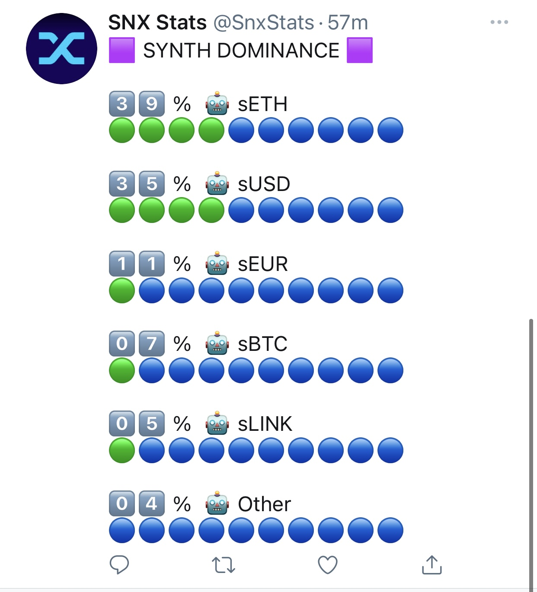

# SNX Stats Tweetbot

Synthtix network Tweetbot.
https://twitter.com/snxstats

Submission for the open DeFi hackthon
https://gitcoin.co/issue/snxgrants/open-defi-hackathon/5/100025663

# 🏃‍♀️ Quick Start

<pre>
npm install
</pre>

running `index.js` will tweet one randomly selected tweet.

# 🤖 Features

### Synthetix API

Expand functionality and queries by modifying `snx-data.js` and `snx-synths.js`

### Emoji Graph & Emoji Number

Emoji utilities `precent-emoji.js`

### Tweet Template

New tweets can be added in the `tweetTemplate.js`

### Dependencies

https://docs.synthetix.io/libraries/js-monorepo/

https://docs.synthetix.io/libraries/synthetix-data/
